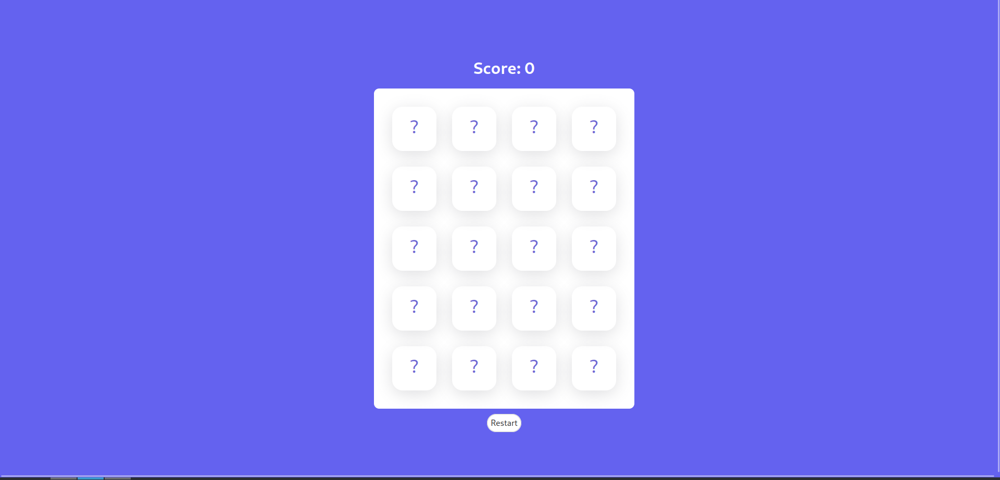
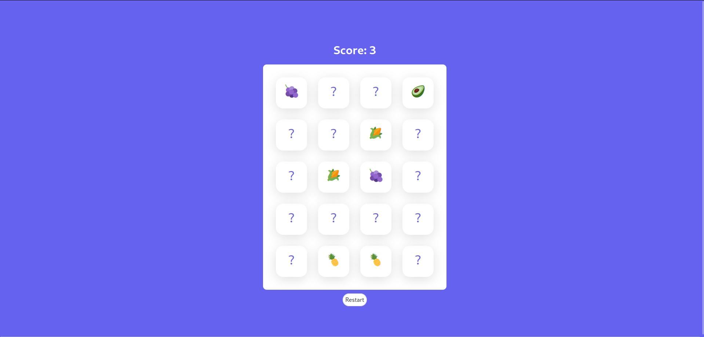

# Memory Card

Simple memory card game build with Svelte

---

## To do:

- [x] I still have to fix a minor bug, that allow user to click multiple tiles and basically crash the game system.
- [ ] I plan to add a timer, so the score is way better than just a tiles counter

---

[Start](https://rad-dolphin-2ff819.netlify.app/)

## 

## 
